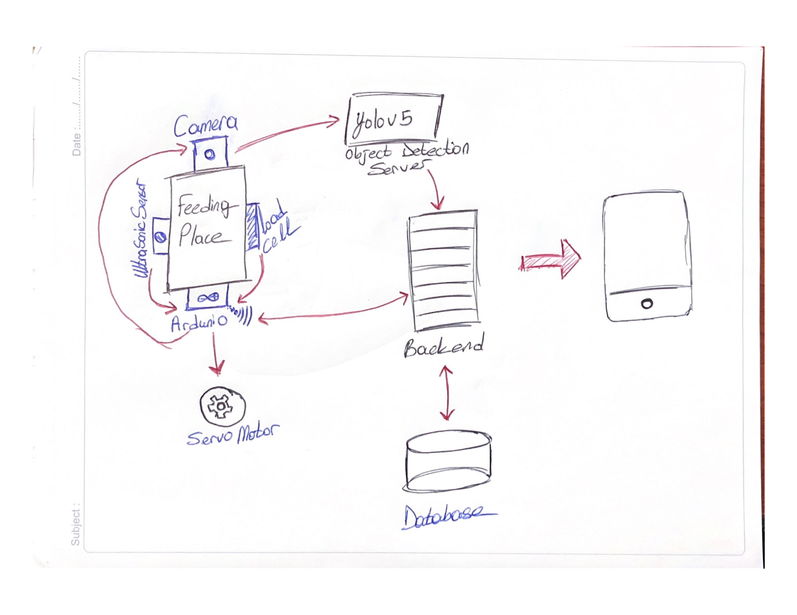

# pet-feed-system
 Automating and monitoring pet feeding remotely with integrating mobile app, IoT, and AI-powered YOLO.

 You can view the system design of the project.

## Credits

- [Erman Avsar (@kontela)](https://github.com/kontela) - Responsible for implementing the entire backend infrastructure and the IoT devices (ESP32, ESP8266) Firmware.
- [@hakanC9](https://github.com/hakanC9) - Worked on the mobile app development and design.
- [@lineyha](https://github.com/lineyha) - Developed Arduino Uno software and its integration to all module connections, e.g. weighter, ultrasonic sensor, servo motor.
- [@bilgeurcuk](https://github.com/bilgeurcuk) - Trained YOLO model for Cat Detection Model and contributed to make it microservice.
